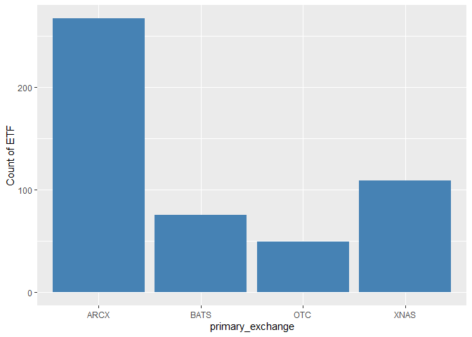
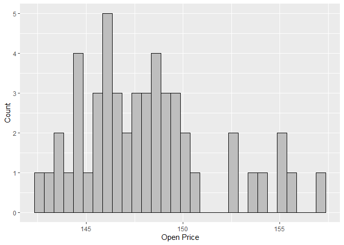
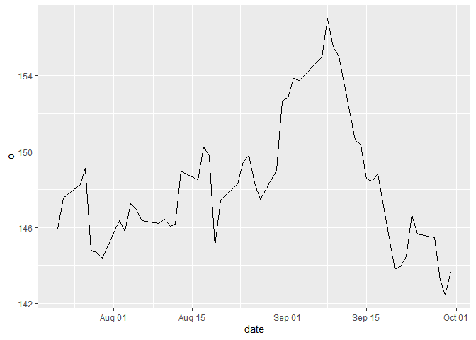
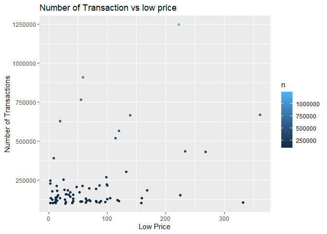
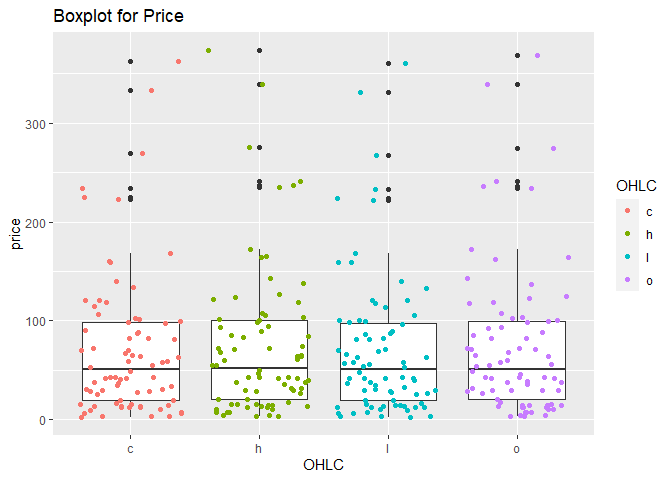

ST558\_Project2\_Group\_2H
================
Manan Shah, Xi Yang

-   [**Required package list**](#required-package-list)
-   [**Functions to query endpoint along with
    modification**](#functions-to-query-endpoint-along-with-modification)
    -   [**Tickers function**](#tickers-function)
    -   [**ticker\_from\_names function**](#ticker_from_names-function)
    -   [**stock\_price**](#stock_price)
    -   [**groupedDaily**](#groupeddaily)
    -   [**previousClose**](#previousclose)
-   [**Creation of new relevant variables after obtaining
    data**](#creation-of-new-relevant-variables-after-obtaining-data)
    -   [**Data source and new
        varaible**](#data-source-and-new-varaible)
-   [**Contingency tables**](#contingency-tables)
    -   [**Two way contigency table**](#two-way-contigency-table)
-   [**Numerical summaries across
    variables**](#numerical-summaries-across-variables)
    -   [**Numerical summary of categorical variable
        movement**](#numerical-summary-of-categorical-variable-movement)
-   [**Plots**](#plots)
    -   [**Bar plot**](#bar-plot)
    -   [**Histogram plot**](#histogram-plot)
    -   [**Line plot**](#line-plot)
    -   [**Scatter Plot**](#scatter-plot)
    -   [**Box plot**](#box-plot)

# **Required package list**

``` r
library(tidyverse)
library(jsonlite)
library(httr)
```

# **Functions to query endpoint along with modification**

## **Tickers function**

The tickers function is used to obtained information of all ticker for a
particular market. By default, the market is common stock. The data is
by default sorted by ticker in ascending order with limit 10. Also, it
is observed that the OTC market does not have exchange. So,
primary\_exchange variable is updated with OTC if it is an OTC market.

``` r
Tickers <- function(type="CS",sort="ticker",order="asc",limit=10){
  
  base <- "https://api.polygon.io/v3/reference/tickers?type="
  type <- type
  sort <- sort
  order <- order
  limit <- limit
  
  url <- paste(base,type,"&sort=",sort,"&order=",order,"&limit=",limit,"&apiKey=OSOTVVjvsUEE8FFAyyX0n3XnWMpFdZv7",sep="")

  data <- GET(url)
  
  parsed <- fromJSON(rawToChar(data$content))
  
  parsed$results <- as_tibble(parsed$results)
  
  parsed$results <- within(parsed$results, primary_exchange[market == "otc"] <- "OTC")

  return(parsed$results)
}
Tickers("ETF", "ticker", "asc", 50)
```

    ## # A tibble: 50 x 12
    ##    ticker name  market locale prima~1 type  active curre~2 cik  
    ##    <chr>  <chr> <chr>  <chr>  <chr>   <chr> <lgl>  <chr>   <chr>
    ##  1 AAA    AAF ~ stocks us     ARCX    ETF   TRUE   usd     0001~
    ##  2 AAAU   Gold~ stocks us     BATS    ETF   TRUE   usd     0001~
    ##  3 AADR   Advi~ stocks us     XNAS    ETF   TRUE   usd     0001~
    ##  4 AAPB   Gran~ stocks us     XNAS    ETF   TRUE   usd     0001~
    ##  5 AAPD   Dire~ stocks us     XNAS    ETF   TRUE   usd     <NA> 
    ##  6 AAPU   Dire~ stocks us     XNAS    ETF   TRUE   usd     <NA> 
    ##  7 AAXJ   iSha~ stocks us     XNAS    ETF   TRUE   usd     0001~
    ##  8 ABEQ   Abso~ stocks us     ARCX    ETF   TRUE   usd     <NA> 
    ##  9 ACES   ALPS~ stocks us     ARCX    ETF   TRUE   usd     0001~
    ## 10 ACIO   Aptu~ stocks us     BATS    ETF   TRUE   usd     0001~
    ## # ... with 40 more rows, 3 more variables:
    ## #   composite_figi <chr>, share_class_figi <chr>,
    ## #   last_updated_utc <chr>, and abbreviated variable names
    ## #   1: primary_exchange, 2: currency_name

## **ticker\_from\_names function**

In this function, if user inputs the name of financial product, its
ticker will be returned. This function is used in stock\_price function.

``` r
ticker_from_names <- function(ticker_name){
  data <- GET("https://api.polygon.io/v3/reference/tickers?active=true&sort=ticker&order=asc&apiKey=OSOTVVjvsUEE8FFAyyX0n3XnWMpFdZv7")
  
  parsed <- fromJSON(rawToChar(data$content))

  result <- as_tibble(parsed$results)

  result <- result %>% filter(name == ticker_name)
  
  return(as.character(result[,c("ticker")]))
}
ticker_from_names("AAREAL BANK AG UNSP/ADR")
```

    ## [1] "AAALY"

## **stock\_price**

This function provides information of a particular stock provided by the
user. Also, the stock name of ticker can be provided. If user provides
stock name, the ticker will be obtained from ticker\_from\_names
function. Also, the output can be modified based on from and to date
provided.

``` r
stock_price <- function(name_or_ticker, stock, from, to){
  x <- name_or_ticker
  if (x == "name"){
    ticker <- ticker_from_names(stock)
  }
  else{
    ticker <- stock
  }
  
  base_1 <- "https://api.polygon.io/v2/aggs/ticker/"
  base_2 <- "/range/1/day/"
  base_3 <- "?adjusted=true&limit=50&apiKey=OSOTVVjvsUEE8FFAyyX0n3XnWMpFdZv7"
  
  url <- paste(base_1, ticker, base_2, from, "/", to, base_3, sep = "")
  data <- GET(url)
  parsed <- fromJSON(rawToChar(data$content))
  return(as_tibble(parsed$results))
}
stock_price("ticker", "AAPL", "2021-07-22", "2022-07-22")
```

    ## # A tibble: 50 x 8
    ##            v    vw     o     c     h     l             t      n
    ##        <dbl> <dbl> <dbl> <dbl> <dbl> <dbl>         <dbl>  <int>
    ##  1  77287356  147.  146.  147.  148.  146. 1626926400000 480209
    ##  2  71447416  148.  148.  149.  149.  147. 1627012800000 457247
    ##  3  72434089  149.  148.  149.  150.  148. 1627272000000 489114
    ##  4 104803028  147.  149.  147.  149.  146. 1627358400000 785621
    ##  5 118931191  145.  145.  145.  147.  143. 1627444800000 829463
    ##  6  56699475  146.  145.  146.  147.  145. 1627531200000 416123
    ##  7  70440626  145.  144.  146.  146.  144. 1627617600000 466325
    ##  8  61351461  146.  146.  146.  147.  145. 1627876800000 458358
    ##  9  63536618  147.  146.  147.  148.  145. 1627963200000 462817
    ## 10  56357771  147.  147.  147.  148.  146. 1628049600000 402501
    ## # ... with 40 more rows

## **groupedDaily**

groupedDaily is a user function to interact with the market data
endpoint of the finacial data API. It returns a data frame with key
metrics (daily open, high, low, and close prices, movement between open
and close price, etc.) for the entire stocks/equities markets. It
accepts one argument, date, and the default value is “2022-10-07”. The
user may enter date to get the data for a specific day. In order to be
user friendly, the input date is divided into three parts:year, month,
and day. It is easy to specify the options and user don’t have to worry
about the format of date. In addition, as there is no data during
weekends, the function has a syntax to determine if it’s a weekend.

``` r
groupedDaily<-function(year=2022, month=10, day=07){
  #Define base combination in url
  base <- "https://api.polygon.io/v2/aggs/grouped/locale/us/market/stocks/"
  #Define Year Input
  Year<-as.character(year)
  #Define Month Input
  if(month<10){
    Month<-paste("0",as.character(month),sep="")
  }
  else{
    Month<-as.character(month)
  }
  #Define Day Input
    if(day<10){
    Day<-paste("0",as.character(day),sep="")
  }
  else{
    Day<-as.character(day)
  }
  Date<-as.Date(paste(Year,Month,Day,sep="-"))
if(grepl("S(at|un)", weekdays(Date))){
   message<- paste("ERROR: The input date is a weekend, there is no data available")
  stop(message)
}
  else{
    url <- paste(base,Date,"?adjusted=true&apiKey=woI7TWx23Hf4JkX9Rghf7tvlpaF3jVma",sep="")
  data <- GET(url)
  parsed <- fromJSON(rawToChar(data$content))
  result <- as_tibble(parsed$results)
  Movement <- if_else(result$o <  result$c, "Up", "Down")
  result$Movement <- Movement
  return(result)
  }
}
groupedDaily()
```

    ## # A tibble: 10,914 x 10
    ##    T          v     vw      o      c      h      l       t     n
    ##    <chr>  <dbl>  <dbl>  <dbl>  <dbl>  <dbl>  <dbl>   <dbl> <int>
    ##  1 POET  5.05e4   2.97   2.97   2.93   3.06   2.81 1.67e12   187
    ##  2 LOAN  4.03e4   5.78   5.78   5.6    5.89   5.59 1.67e12   226
    ##  3 GPOR  1.41e5  95.9   96.8   95.2   98.6   94.7  1.67e12  4030
    ##  4 EAF   2.54e6   4.23   4.17   4.23   4.27   4.16 1.67e12 12585
    ##  5 DLB   2.80e5  65.1   66.6   64.9   66.6   64.6  1.67e12  6679
    ##  6 VNO   5.33e6  21.3   21.8   21.3   22.0   21.1  1.67e12 26901
    ##  7 WTFCP 1.77e4  25.0   25.0   25.1   25.2   25.0  1.67e12   153
    ##  8 VV    8.05e5 167.   169.   166    169.   165.   1.67e12  4034
    ##  9 FTCI  1.07e6   2.80   2.85   2.8    2.90   2.75 1.67e12  7804
    ## 10 WNC   3.29e5  16.3   16.6   16.2   16.7   16.1  1.67e12  3886
    ## # ... with 10,904 more rows, and 1 more variable:
    ## #   Movement <chr>

## **previousClose**

previousClose allows the user to select a specified stock ticker of
interest and receive the previous day’s OHLC (open, high, low, and
close) price for that stock ticker, as well as the number of
transactions, the trading volume of the symbol, etc. It accepts one
argument, stock ticker, and the default value is “AAPL”.

``` r
previousClose <- function(stockTicker="AAPL"){
  #Define base combination in url
  base <- "https://api.polygon.io/v2/aggs/ticker/"
  #Define stockTiker Input
  StockTicker<-stockTicker
    url <- paste(base,StockTicker,"/prev?adjusted=true&apiKey=woI7TWx23Hf4JkX9Rghf7tvlpaF3jVma",sep="")
  data <- GET(url)
  parsed <- fromJSON(rawToChar(data$content))
  return(as_tibble(parsed$results))
}
previousClose()
```

    ## # A tibble: 1 x 9
    ##   T            v    vw     o     c     h     l          t      n
    ##   <chr>    <dbl> <dbl> <dbl> <dbl> <dbl> <dbl>      <dbl>  <int>
    ## 1 AAPL  77001872  140.  140.  139.  141.  138.    1.67e12 608882

# **Creation of new relevant variables after obtaining data**

## **Data source and new varaible**

Creating a data source which is an independent combination of ETF
Tickers and AAPL stock price.

``` r
data <- list(Tickers("ETF", "ticker", "asc", 500), stock_price("ticker", "AAPL", "2021-07-22", "2022-07-22"))
```

Using stock price data of AAPL, we have created variable movement which
determines whether there is an up movement or down movement for a
particular day.

``` r
data_new_variable <- data[[2]]
Movement <- if_else(data_new_variable$o < data_new_variable$c, "Up", "Down")
data_new_variable$Movement <- Movement
data_new_variable
```

    ## # A tibble: 50 x 9
    ##           v    vw     o     c     h     l       t      n Movem~1
    ##       <dbl> <dbl> <dbl> <dbl> <dbl> <dbl>   <dbl>  <int> <chr>  
    ##  1   7.73e7  147.  146.  147.  148.  146. 1.63e12 480209 Up     
    ##  2   7.14e7  148.  148.  149.  149.  147. 1.63e12 457247 Up     
    ##  3   7.24e7  149.  148.  149.  150.  148. 1.63e12 489114 Up     
    ##  4   1.05e8  147.  149.  147.  149.  146. 1.63e12 785621 Down   
    ##  5   1.19e8  145.  145.  145.  147.  143. 1.63e12 829463 Up     
    ##  6   5.67e7  146.  145.  146.  147.  145. 1.63e12 416123 Up     
    ##  7   7.04e7  145.  144.  146.  146.  144. 1.63e12 466325 Up     
    ##  8   6.14e7  146.  146.  146.  147.  145. 1.63e12 458358 Down   
    ##  9   6.35e7  147.  146.  147.  148.  145. 1.63e12 462817 Up     
    ## 10   5.64e7  147.  147.  147.  148.  146. 1.63e12 402501 Down   
    ## # ... with 40 more rows, and abbreviated variable name
    ## #   1: Movement

# **Contingency tables**

## **Two way contigency table**

A two way contingency table for tickers data is created. First, we
create factors or market and primary\_exchange column. Next, we create a
contingency table using table function.

``` r
contingency_data <- data[[1]]
contingency_data$market <- as.factor(contingency_data$market)
contingency_data$primary_exchange <- as.factor(contingency_data$primary_exchange)
contingency_table <- table(contingency_data$market, contingency_data$primary_exchange)
contingency_table
```

    ##         
    ##          ARCX BATS OTC XNAS
    ##   otc       0    0  49    0
    ##   stocks  267   75   0  109

# **Numerical summaries across variables**

## **Numerical summary of categorical variable movement**

Next, let’s pull a summary of the financial data for a special day by
calling groupedDaily(). One of the most concerning aspects of financial
data is whether the stock price has been up or down. I wanted to look at
the average, standard deviation, median and IQR values of high price for
both up movement stock and down movement stock in a day. In the
meantime, the stock with the number of transaction greater than 100,000
times is selected assuming it more popular and attractive. Looks like
the average, standard deviation, median and IQR values of high price for
down movement stock is higher than up movement stock. It may imply that
these down movement stocks have been on the rise for a while. Next, the
stock price has fallen all the way after the opening of the market on a
certain day. When this phenomenon occurs, investors should pay high
attention to it. Therefore, once the stock price continues to fall in
the market, investors should sell decisively.

``` r
library(tidyverse)
groupedDaily() %>%
  filter(n>=100000) %>%
  group_by(Movement) %>%
  arrange(desc(n)) %>% 
  summarise(Avg=mean(h),Sd=sd(h),Median=median(h),IQR=IQR(h))
```

    ## # A tibble: 2 x 5
    ##   Movement   Avg    Sd Median   IQR
    ##   <chr>    <dbl> <dbl>  <dbl> <dbl>
    ## 1 Down      78.2  78.9   55.1  80.5
    ## 2 Up        45.5  34.7   43.1  44.9

# **Plots**

## **Bar plot**

Here, we created bar plot of categorical variable primary\_exchange vs
quantitative variable number of ETF traded on exchange. We conclude that
ARCX is most active exchange and nearly 50 percent of ETF are traded in
ARCX. The other exchange where ETF are traded extensively are in order
XNAS, BATS and OTC.

``` r
data_1 <- data[[1]]
bar_plot_data <- data_1 %>% count(primary_exchange)
bar_plot <- ggplot(data = bar_plot_data, aes(primary_exchange, n)) + labs(y = "Count of ETF") + geom_bar(stat = "identity", fill = "steelblue")
bar_plot
```

<!-- -->

## **Histogram plot**

Here, we plot a histogram of quantitative variable open price. Each bar
shows the number of times open price falls in the range of the bar
created. From the plot, we conclude that the stock’s open price is
mainly in the range of 145 to 150.

``` r
data_2 <- data[[2]]
hist_plot_data <- data_2 %>% select(o)
hist_plot <- ggplot(data = hist_plot_data, aes(o)) + labs(x = "Open Price", y = "Count") + geom_histogram(color="black", fill="grey")
hist_plot
```

    ## `stat_bin()` using `bins = 30`. Pick better value with
    ## `binwidth`.

<!-- -->

## **Line plot**

First, a new column date is created which converts the unix millisecond
date time into date. Later, we create line plot for the movement of
stock price against date. The graph says that there was highest
volatility in stock price from 1st September to 15th September.

``` r
data_4 <- data[[2]]
line_plot_data <- mutate(data_4, date =  as.POSIXct(data_4$t/1000, origin="1970-01-01"))
line_plot <- ggplot(line_plot_data, aes(date, o)) + geom_line()
line_plot
```

<!-- -->

## **Scatter Plot**

Below, a scatter plot is created between number of transaction and low
price. The goal was to compare whether there is a linear relationship
between the two variables. The stock with the number of transaction
greater than 100,000 times are selected here as well. The pattern looks
like there is not a strong linear relationship bewteen number of
transaction and low price. But, the conclusion is low price on a special
day of most stock is less than $150, and the number of transaction is
less than 250,000 times. With the growth of price, the number of
transaction is increasing.

``` r
popularData<- groupedDaily() %>%
  filter(n>100000) %>%
  arrange(desc(n))
g<- ggplot(popularData, aes(x=l, y=n))
g+geom_point(aes(col=n))+
  labs(title="Number of Transaction vs low price", x = "Low Price", y = "Number of Transactions")
```

<!-- -->

## **Box plot**

The daily stock price is compared among open, close, high, and low
price, using a boxplot. Here, the stock with the number of transaction
greater than 100,000 times were dropped for this plot. This boxplot was
interesting. There is no significant difference among open, close, high,
and low price. It explains that the market is very stable. The opening
price is similar to the closing price which implies the shock amplitude
of the entire trading day is also small, and the trading volume is
appropriate. It is speculated that there are institutions entering, and
it is unlikely that there will be large hot money entering.

``` r
library(tidyverse)
library("ggplot2")
popularData<- groupedDaily() %>%
  filter(n>100000) %>%
  arrange(desc(n)) %>%
  select(T,o,c,h,l) %>%
  pivot_longer(cols=2:5, names_to="OHLC", values_to="price")
g<- ggplot(popularData,aes(x=OHLC,y=price))
g+ geom_boxplot()+
  geom_jitter(aes(col=OHLC))+
  labs(title="Boxplot for Price")
```

<!-- -->
